# Shark Hack 2018 - Alexa Skill Workshop

What we need to get going!

## Prerequisites
+ Amazon Alexa Mobile App on [Android](https://play.google.com/store/apps/details?id=com.amazon.dee.app) or [iOS](https://itunes.apple.com/us/app/amazon-alexa/id944011620?mt=8)

## Resources
The resources folder contains all the code used in cloud9... This will already be available in your cloud9
environment but if it gets deleted or overwritten you can always copy it over again from here.

# Team AWS Account
As each team will have a single AWS Account, we want each team member to have an user on the account!

## Team Cloud9 Environment
With your Team's AWS account, go to [Cloud9](https://console.aws.amazon.com/cloud9/home) in the AWS Console.

In the left hand menu click on 'Shared with you' and launch your teams Sharkathon2018 environment:

# Test Setup
## Create a New Lambda
1. On the welcome screen select create new Lambda
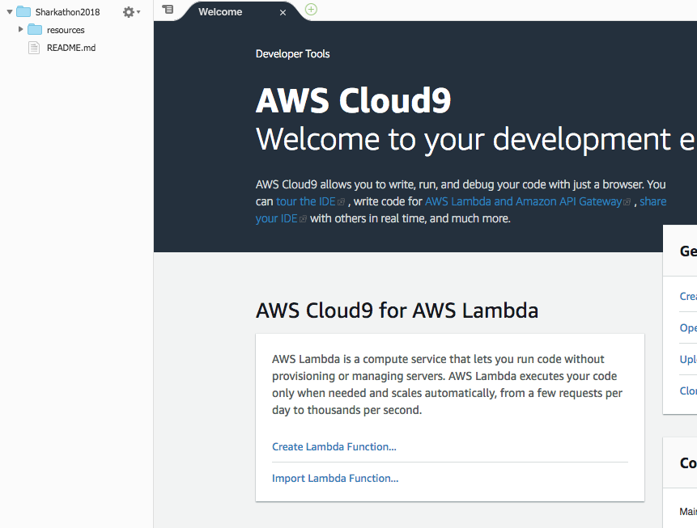

2. Give it a unique name
        - FunctionName: {yourname}HelloAlexa
        - ApplicationName: {yourname}Sharkathon2018
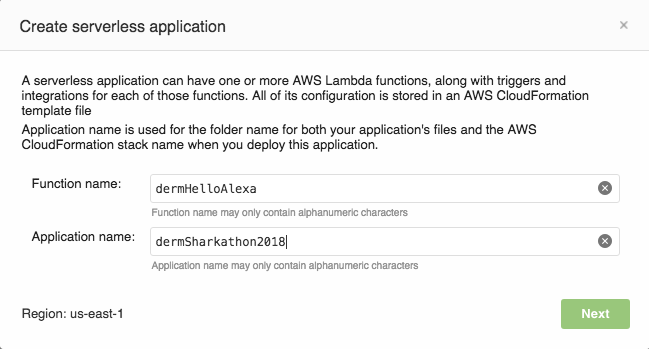

3. Select empty Node project type
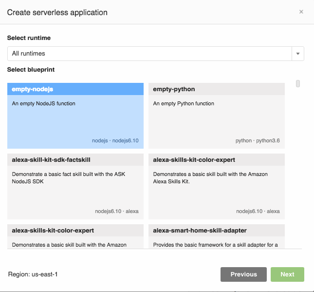

4. Continue selecting all the defaults
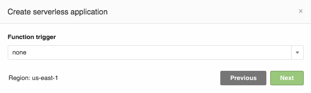
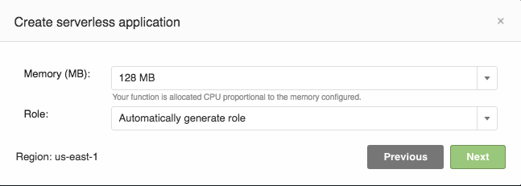
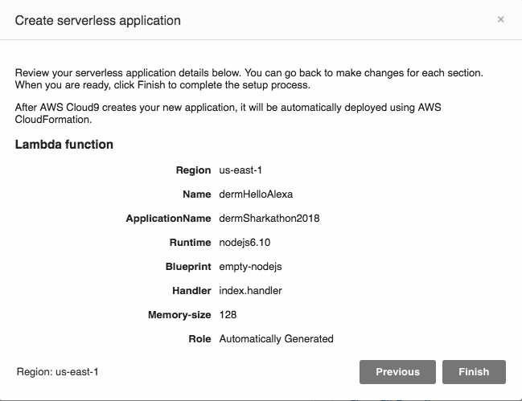

## Install Alexa dev packages
1. Open a new terminal
To do this go to the bottom pane and hit the green + button

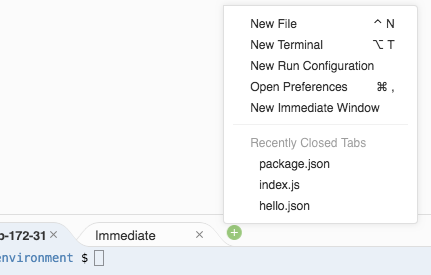

2. Install dependencies through the new terminal
    * change to your application folder

        ```
        cd {yourname}Sharkathon2018
        ```

        For Example: cd dermSharkathon2018
    * Copy over the package.json file from resources

        ```
        cp ../resources/package.json package.json
        ```
    * Install node dependencies (alexa sdk, aws sdk...)
    
        ```
        npm install
        ```
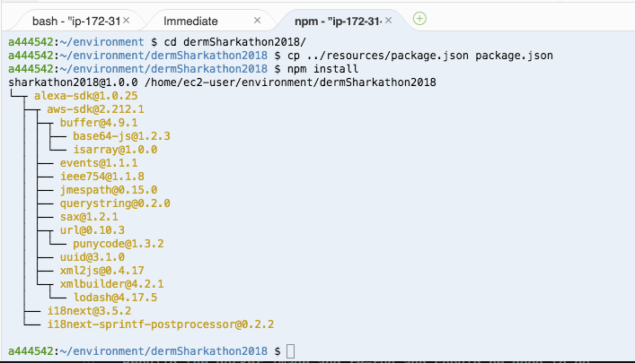

## Setup your Alexa Handler
Update the index.js file with the sample code from index.js in 
resources to your lambda function
* {yourname}HelloAlexa

    ```
    cp ../resources/index.js {yourname}HelloAlexa/index.js
    ```
    For example: cp ../resources/index.js dermHelloAlexa/index.js
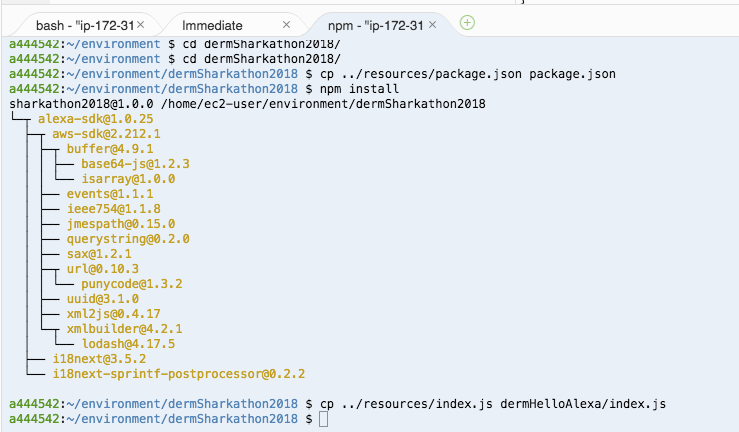

Note you can also do this by right-clicking on the index.js file in the
resources folder and copying it to your function folder

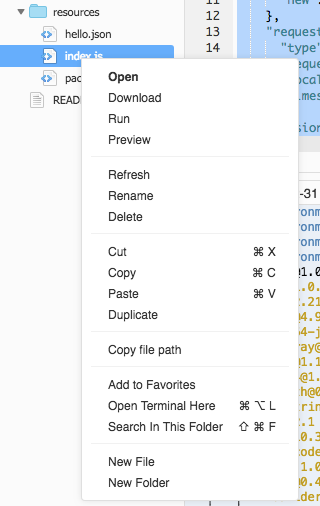

## Locally test your Alexa Handler
1. Double click your index.js file in your personal folder and make sure it's 
open in the editor.
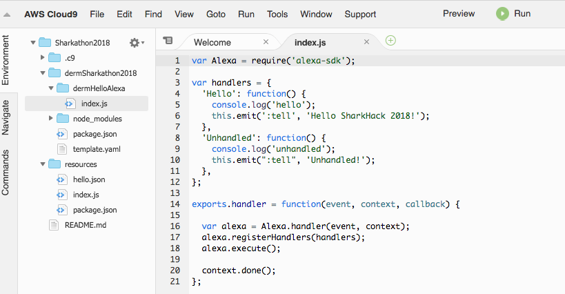

2. Click the green Run button
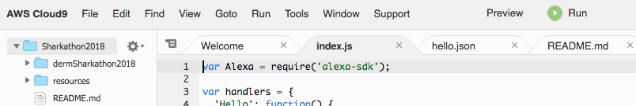

3. Delete everything in the payload section. Then open the hello.json file
in resources and copy and paste all the text from there into the payload 
section
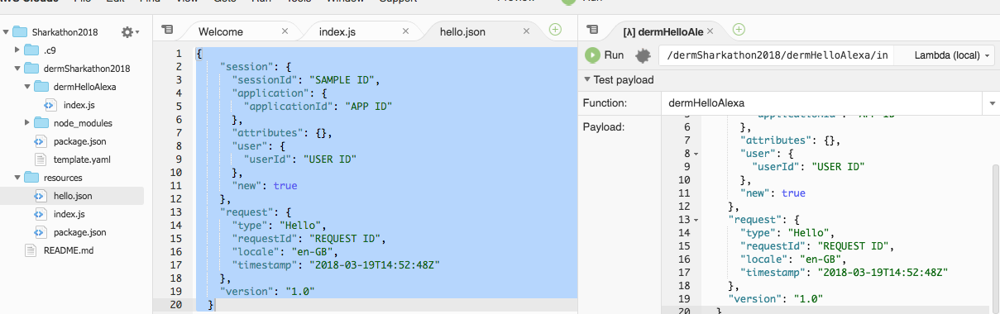

4. Finally hit the Run button and you should see a successful
test response that includes "Hello SharkHack 2018!"
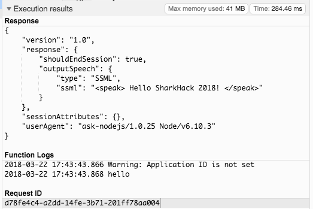

## To The Cloud!!
With our function working as intended, now we can deploy our code so it's public!
This is as simple as 

1. Deploy the Lambda
    * opening the AWS Resources panel
    * Right-clicking your hello Alexa lambda
    * hitting deploy
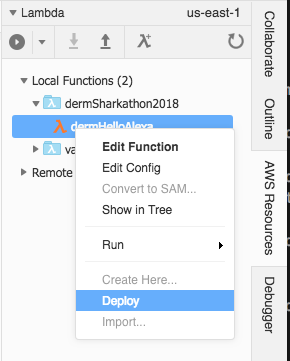

2. Add the Alexa Skill Trigger to your lambda
    * go to the lambda console
    click on services and search for lambda
    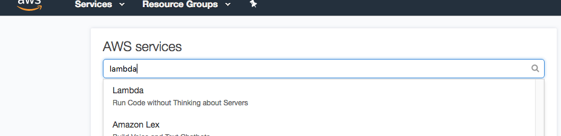

    * select your function from the list of functions
    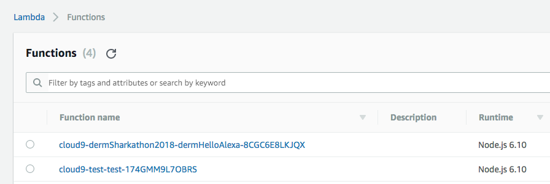

    * find the alexa skills kit trigger
    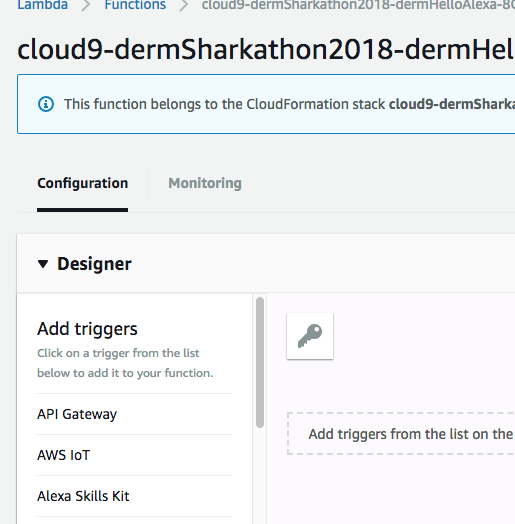

    * click this to add it to your function
    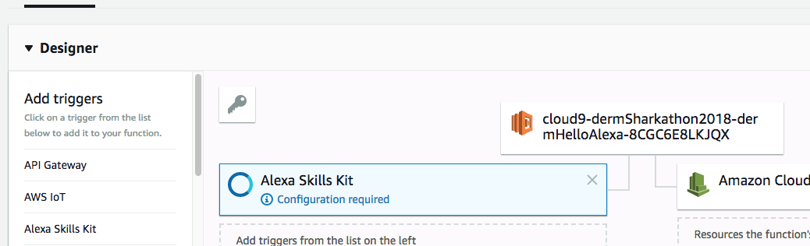

    * scroll to the bottom of the screen and disable skill id verification
    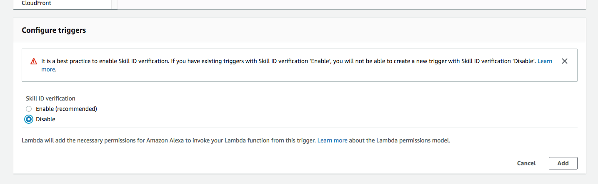
    
    * finally save all your changes
    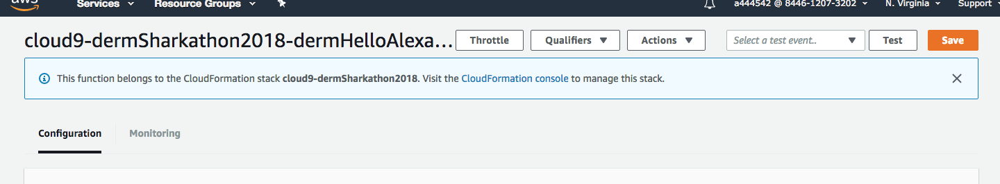

## To The Mic
1. Head to [03_alexa_skill](../../03_alexa_skill) to continue!
