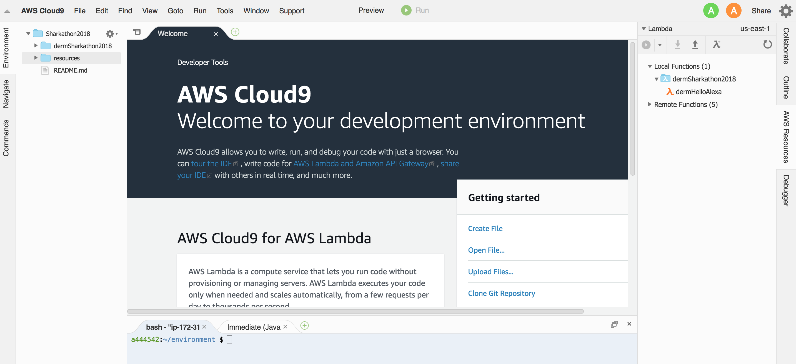

# Shark Hack 2018 - Alexa Skill Workshop

What we need to get going!

# AWS Account
Each participant can get an AWS login [here](https://goo.gl/forms/BzgILD0XIBlkxR5K2) - the password will be provided in the workshop!

# Alexa Account
There are 6 echo dots, one for each team! The login information for the Alexa Developer Console is taped to the bottom of the Echo Dot.

## Access AWS
Log into the [AWS console](http://sharkhack.signin.aws.amazon.com/console?region=us-east-1).

## Team Cloud9 Environment
With your Team's AWS account, go to [Cloud9](https://us-east-1.console.aws.amazon.com/cloud9/home/shared) in the AWS Console.

Connect to your team's Sharkathon2018 environment by clicking the "Open IDE" button:

Note the environment may take a couple of mins to load, but once loaded you should see a screen similar to below:

## Keyboards At The Ready...
1. Head to [02_code](../02_code) to continue!
