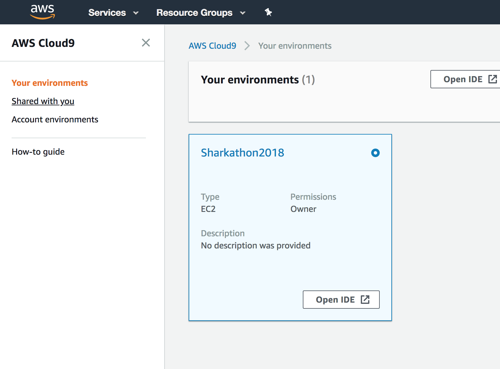

# Shark Hack 2018 - Alexa Skill Workshop

What we need to get going!

## Prerequisites
+ Amazon Alexa Mobile App on [Android](https://play.google.com/store/apps/details?id=com.amazon.dee.app) or [iOS](https://itunes.apple.com/us/app/amazon-alexa/id944011620?mt=8)

## Resources
The [resources](../resources) folder contains all the code used in cloud9... This will already be available in your cloud9 environment but if it gets deleted or overwritten you can always copy it over again from here.

# Team AWS Account
We have created an AWS account for each team and seeded users
for each team member. Login details will be shared at the start of the workshop.

## Access AWS
After logging into the [AWS console](https://console.aws.amazon.com/console/home) for the first time make sure the region is set to us-east-1.

* go to the top right hand corner and select US East N Virginia

## Team Cloud9 Environment
With your Team's AWS account, go to [Cloud9](https://console.aws.amazon.com/cloud9/home) in the AWS Console.

In the left hand menu click on 'Shared with you' and launch your teams Sharkathon2018 environment by clicking the "Open IDE" button:

Note the environment may take a couple of mins to load as if its's the first time the ec2 machine it's running on will need to be started. Once loaded you should see a screen similar to below

## Keyboards At The Ready...
1. Head to [02_code](../02_code) to continue!