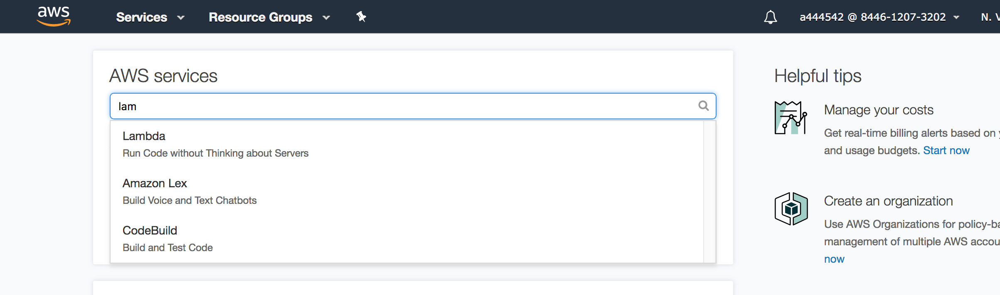
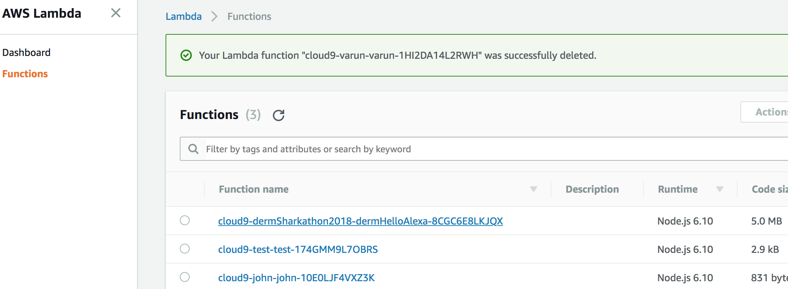
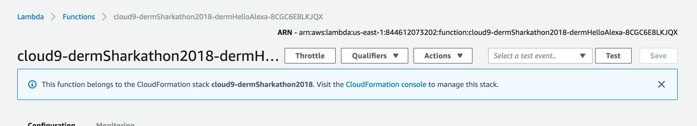

# Shark Hack 2018 - Alexa Skill Workshop

Time to allow Alexa to call our function!

# Build our Skill
## Amazon Developer Console

Login to the Alexa [Skill Console](https://developer.amazon.com/alexa/console/ask) and click 'Create Skill':

<<<<<<< HEAD
Give our skill the name 'Shark Hack 2018' and click 'Next':

We have several types of Alexa skills, but with the Echo Dot we want to select the 'Custom' skill and click 'Create Skill':

=======
Give our skill the name '{Your Name} Shark Hack 2018' and click 'Next':

We have several types of Alexa skills, but for this workshop, we want to select the 'Custom' skill and click 'Create Skill':
>>>>>>> 15e9ea4e5fcc1582ec53d83f7641813c72f0c66b

From the Skill Dashboard, we want to click 'Invocation Name' on the right!

<<<<<<< HEAD
This is what we will actually say to Alexa, this needs to be unique... 
so lets put it down as '{yourname} shark hack' and then click 'Save Model':

Click 'Intents (3)' on the left menu. There are a lot of Amazon provided intents, but from our Lambda remember we created the intent 'Hello'. Click 'Add Intent':

Set the intent name to 'Hello' and click 'Create custom intent':
* Note this is case sensitive so make sure you spell it as __H__ello

For each intent that we set, we need to tell Alexa what the user would say to trigger it
* Let us kick off 'Hello' whenever the user says 'hello', 'hi', or 'hey'! 
* Click 'Save Model'  
* Then click 'Build Model'

=======
This is what we will actually say to Alexa, so lets put it down as '{your name} shark hack'.
Click 'Save Model':

Click 'Intents (3)' on the left menu. There are a lot of Amazon provided intents, but from our Lambda remember we created the intent 'Hello'. 
Click 'Add Intent':

Set the intent name to 'Hello'. Note that this is case sensitive to the function we covered in index.js!
Click 'Create custom intent':

For each intent that we set, we need to tell Alexa what the user would say to trigger it - let us kick off 'Hello' whenever the user says 'hello', 'hi', or 'hey'! 
Click 'Save Model'.
Click 'Build Model' - this will take a minute!
>>>>>>> 15e9ea4e5fcc1582ec53d83f7641813c72f0c66b

## On the AWS Console
Before we go to the next step, we want to return to the [AWS Console](https://console.aws.amazon.com/lambda/home?region=us-east-1#/functions) 

* launch the lambda console

* select our function

* and copy down the lambdas ARN

For example arn:aws:lambda:us-east-1:844612073202:function:cloud9-dermSharkathon2018-dermHelloAlexa-8CGC6E8LKJQX

## Alexa Developer Console

Back to the Alexa Developer Console, and click Endpoint, and paste this ARN into the default region. Click build:

# Test our Skill
With this complete, click the Test in the menu, and enter: 'open shark hack hi' and expect to get our response from the lambda:

## Onto the Device
1. Head to [04_echo_dot](../04_echo_dot) to continue!
